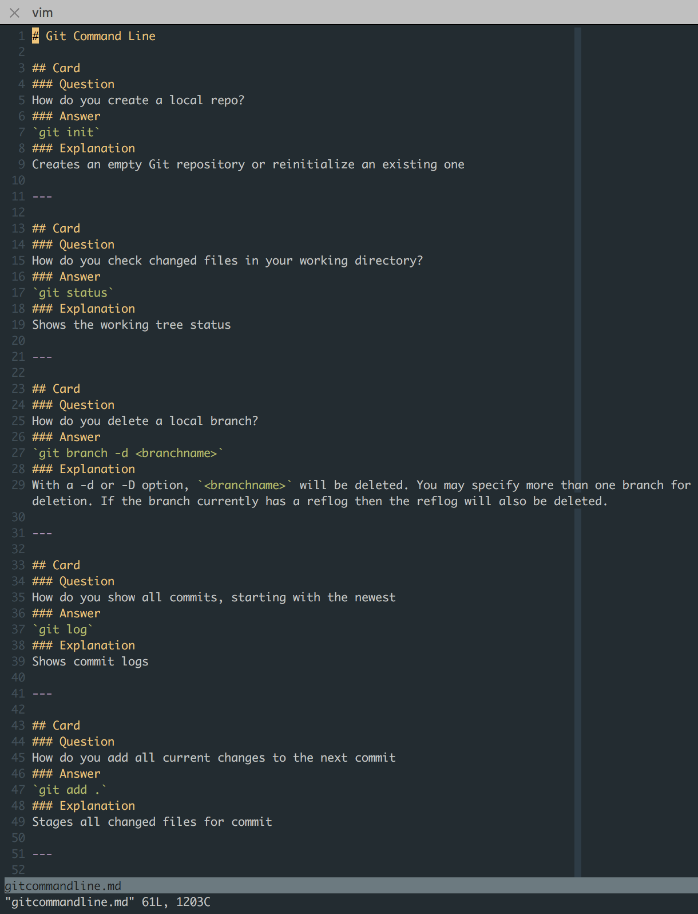

# MemoWise
[](https://travis-ci.org/dtjv/memowise)

A flashcard web application.


## Demo

[Live Demo](https://memowise.herokuapp.com/)

## Features

* MemoWise offers a simple and intuitive UI for the desktop or mobile device.
* Each deck studied displays a progress bar to indicate percent of cards studied.
* Similar to physical cards, each MemoWise card displays a prompt on one side and the answer on the reverse.
* Write cards in markdown and import them into MemoWise

## Deck Import

You can import decks of flashcards using a command line utility.

### Usage

```
$ npm run import -- --help

Flashcard Import Tool

Usage:
  deck-import [<options>]

Options:
  --help     Prints usage
  -a         Import all decks (default)
  -f <file>  Import only deck <file>

Examples:
  $ deck-import -a
  $ deck-import -f math.md
```

> The `bin/deck-import` utility is not installed globally. An npm script is provided and flags are passed to that script using `--` followed by the flag (i.e. `npm run import -- -f math.md`). By default the utility loads decks from `docs/decks/`.

### Writing Flash Cards

A deck of flashcards are written in one markdown file.



The structure complies to the following format. Text inside `[` and `]` are placeholders for values that you add. All other text are keywords. It's best to view the sample decks in `docs/decks/`.

```
  # [ Title ]

  ## Card
  ### Question
  [ write question ]
  ### Answer
  [ write answer ]
  ### Explanation
  [ write an explanation of the answer ]
  ---
  ## Card
  ### Question
  [ write question ]
  ### Answer
  [ write answer ]
  ### Explanation
  [ write an explanation of the answer ]
  ---
```

## Tech Stack

* MongoDB
* Express
* React
* React Router
* Redux
* [PassportJS](http://passportjs.org/)
* Mocha/Chai
* [CodeceptJS](http://codecept.io/)
* [Materialize CSS](http://materializecss.com/)

## Services

* [TravisCI](https://travis-ci.org/)
* [Codecov](https://codecov.io/)
* [Sauce Labs](https://saucelabs.com/)

## Steps to Run Application 

#### Step 1: Install MongoDB via Homebrew

```
$ brew install mongodb
```

#### Step 2: Clone and Install Repo

```
$ git clone https://github.com/dtjv/memowise.git
$ cd memowise/
$ npm install
```

#### Step 3: Configure

Copy `.env.example` to `.env`. Then set all environment variables. An *example* is provided below.

```
NODE_ENV=development
HOST=http://localhost
PORT=3000
MONGODB_URI=mongodb://localhost:27017/memowise
SESSION_SECRET=memowise
```

#### Step 4: Build 

```
$ npm run build 
```

> **Recommended**: For development, watch files: `npm run build -- --watch`

#### Step 5: Start Mongo Server

Open a new terminal and type:

```
$ mongod
```

#### Step 6: Start Application Server

Open another terminal and type: 

```
$ npm start
```

> **Recommended**: For development, install [nodemon](https://www.npmjs.com/package/nodemon) globally, then type: `nodemon src/server/server.js`. 

#### Step 7: Study!

Navigate to configured url. Using the example in Step 3, go to **http://localhost:3000**.


#### Step 8: Mongo CLI *(optional)*

Open another terminal and type:

```
$ mongo
```
> This allows you to inspect the database and clear out data if needed during development.

Some common mongo CLI commands that are useful:

```
> show dbs
> show collections
> use [db-name] 
> db.[collection-name].find({})
> db.[collection-name].remove({})
> db.dropDatabase()
```

## Other Commands

#### Selenium Server

Open a separate terminal and type:

```
$ npm run selenium
```

#### Lint

```
$ npm run lint
```

#### Test (Unit & Integration)

```
$ npm test
```
> **IMPORTANT**: Ensure the [MongoDB Server](#step-5-start-mongo-server) **and** the [Application Server](#step6-start-application-server) are running.

#### Acceptance Tests (End-2-End)

```
$ npm run e2e
```
> **IMPORTANT**: Ensure the follow are running:
>
> * [MongoDB Server](#step-5-start-mongo-server) 
> * [Application Server](#step6-start-application-server)
> * [Selenium Server](#Selenium)


#### Coverage

To see detailed coverage report in HTML.

```
$ npm run coverage
```

## Data Model

#### `users` Collection

An example of a `user` entry in the `users` collection.

```js
{
  "_id": ObjectId("113lhq3t8hagg901"),
  "name": "Bob Hope",
  "email": "bob@hope.com",
  "password": "flk3fqT(#U%!aw#351a"
}
```

#### `decks` Collection

An example of a `deck` entry in the `decks` collection.

```js
{
  "_id": ObjectId("10d9hw6g6e198h5a"),
  "name": "Math"
}
```

#### `cards` Collection

An example of a `card` entry in the `cards` collection.

```js
{
  "_id": ObjectId("1309uhag9q17g22g")
  "deckId": "10d9hw6g6e198h5a",
  "question": {
    "text": "What is 3 + 3?"
  },
  "answer": {
    "text": "6",
    "explanation": "It is simple addition"
  }
}
```

#### `plays` Collection

An example of a `play` entry in the `plays` collection.

```js
{
  "_id": ObjectId("143jhqfp9qwkasf8"),
  "deckId": "10d9hw6g6e198h5a",
  "cardId": "1309uhag9q17g22g",
  "userId": "113lhq3t8hagg901",
  "side": "0",
  "rating": "-1" 
}
```

## Application State

We're using [Redux](http://redux.js.org/) to store our application state. Here are the top level state properties.

#### `decks`

Holds all decks in the database.

#### `deck`

Holds the currently selected deck the user is studying.

#### `card`

Holds the current card being studied

#### `plays`

Holds the stats of each card studied by each user. A `side` can hold a value of 0 or 1 for displaying the front or back of a card. A `rating` can hold a user's self assessment of how she performed on a studied card (-1 = poor, 0 = ok, 1 = great).

#### Sample State

Below is a sample snapshot of what the state looks like.

```json
{
  "decks": [
    { "_id": "123", "name": "Math" },
    { "_id": "246", "name": "JavaScript" }
  ],
  "deck": {
    "_id": "123",
    "name": "Math"
  },
  "card": {
    "_id": "987",
    "deckId": "123",
    "question": {
      "text": "What is 3 + 3"
    },
    "answer": {
      "text": "6",
      "explanation": "It is simple addition"
    },
  },
  "user": {
    "_id": "777",
    "name": "Joe",
    "email": "joe@example.com",
    "password": "hashed$password"
  },
  "play": {
    "side": 0,
    "deckId":"123",
    "cardId": "987",
    "userId": "777",
    "rating": 1
  }
}
```

## Todo

* [x] Add e2e tests 
* [ ] Restructure ([Resource](https://jaysoo.ca/2016/02/28/organizing-redux-application/))
* [x] Deploy
* [ ] Integrate Materialize Sass into build
* [ ] Use [SM-2](https://www.supermemo.com/english/ol/sm2.htm) algorithm for card selection 
* [ ] Improve profile UI

## Credit 

The original team:

- *Product Owner*: Alex Wong
- *Scrum Master*: Matt Vargeson
- *Development Team Members*: Peter Chim, David Valles

This repo is *big* refactor of the [original code](https://github.com/wonky-mongoose/wonky-mongoose).

## License

MIT © David Valles

